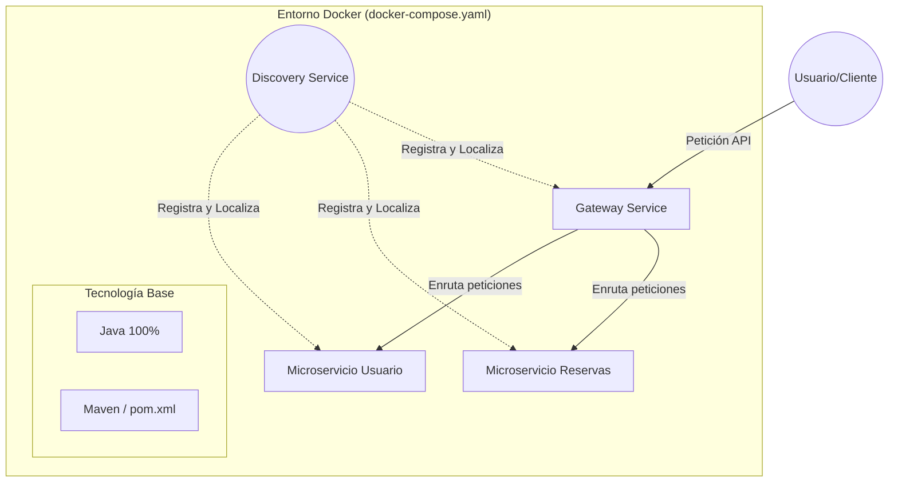

# Documentación Técnica: Proyecto igs20252026

## 1. Arquitectura del Sistema
El proyecto está diseñado bajo un **patrón de arquitectura de microservicios**, donde cada componente es independiente y cumple una función específica dentro del ecosistema. El sistema es **100% Java**, lo que asegura consistencia en el stack tecnológico de todos sus módulos.

La arquitectura se organiza en los siguientes niveles:

*   **Infraestructura y Descubrimiento (`discovery/`):** Implementa el servidor de nombres que permite la comunicación entre microservicios sin necesidad de conocer sus direcciones IP estáticas.
*   **Puerta de Enlace (`gateway/`):** Actúa como el **API Gateway**, centralizando el tráfico de entrada, gestionando la seguridad y redirigiendo las peticiones a los servicios correspondientes.
*   **Servicios de Dominio:**
    *   **`reservas/`**: Microservicio dedicado a la lógica de negocio de transacciones y disponibilidad.
    *   **`usuario/`**: Microservicio encargado de la gestión de perfiles, autenticación y datos de usuario.

## 2. Tecnologías y Herramientas
El stack tecnológico identificado se compone de herramientas estándar de la industria para entornos distribuidos:

*   **Lenguaje Base:** **Java (vía Maven)**, utilizado en la totalidad del código fuente.
*   **Gestor de Dependencias:** **Maven**, identificado por la presencia del archivo `pom.xml` en la raíz del proyecto, el cual centraliza el ciclo de vida de la construcción.
*   **Contenerización:** **Docker**, mediante el uso de `docker-compose.yaml`, lo que permite replicar el entorno de ejecución exacto en cualquier máquina.
*   **Control de Versiones:** Git, con una política de exclusión de archivos temporales definida en `.gitignore`.

## 3. Dependencias y Versiones
Aunque los fragmentos de las fuentes no detallan el contenido específico del archivo `pom.xml`, se puede inferir el uso de dependencias críticas basadas en la estructura del proyecto:

*   **Framework de Microservicios:** La estructura con módulos de *discovery* y *gateway* es característica del ecosistema **Spring Cloud** (Spring Cloud Netflix Eureka para el descubrimiento y Spring Cloud Gateway para el enrutador).
*   **Gestión de Versiones:** La configuración de versiones se maneja a través de Maven. *Nota: Las versiones exactas de Java o Spring no figuran en las fuentes proporcionadas, por lo que se recomienda consultar el archivo `pom.xml` directamente para verificar si se utiliza Java 11, 17 o superior.*

## 4. Gestión de Despliegue
El proyecto facilita un **despliegue orquestado** mediante **Docker Compose**. El archivo `docker-compose.yaml` integra los cuatro servicios principales (`discovery`, `gateway`, `reservas` y `usuario`), permitiendo que el sistema se inicie como un solo conjunto de contenedores interconectados.

## 5. Información Legal y Licenciamiento
El software se distribuye bajo la **Licencia Apache-2.0**. Esta licencia es de tipo permisivo, lo que otorga libertad para:
*   Usar, modificar y distribuir el código.
*   Garantizar la protección de patentes para los usuarios del software.
*   Utilizarlo tanto en proyectos comerciales como de código abierto, siempre que se mantenga la nota de copyright original.

## 6. Estado del Proyecto
*   **Actividad:** El repositorio cuenta con un historial inicial de 7 commits.
*   **Versiones:** Actualmente no hay "Releases" o etiquetas de versión publicadas oficialmente, lo que indica que el proyecto podría estar en una **fase activa de desarrollo o prototipado**.

